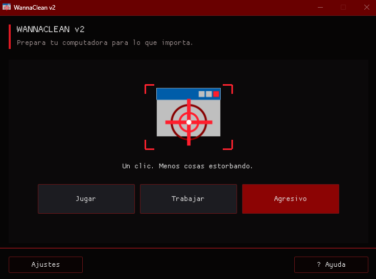
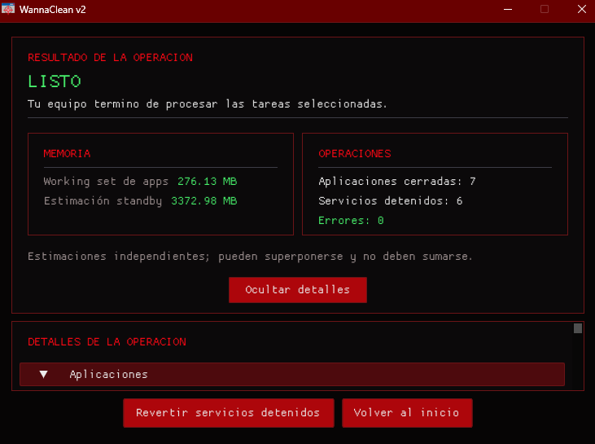

# WannaClean v2

**Prepara tu computadora para lo que importa.**

WannaClean es una utilidad para Windows que cierra las aplicaciones y detiene los servicios que elijas antes de una tarea pesada, como jugar. También puede limpiar memoria de trabajo y caché.

Cada preset trae una lista por defecto de aplicaciones y servicios, y tú la ajustas a tu gusto en **Ajustes**. Lo que no está en la lista, no se toca.

La estética es una parodia de ransomware, pero no cifra ni elimina archivos.

<p align="center">
  
  
</p>

Las estimaciones de memoria son independientes y pueden superponerse; no deben sumarse. No garantizan más FPS ni una mejora específica del rendimiento.

## Qué puedes hacer

- Ejecutar los presets **Jugar**, **Trabajar** y **Agresivo**.
- Elegir en **Ajustes** qué aplicaciones y servicios procesa cada preset.
- Revisar los objetivos detectados antes de ejecutar **Agresivo**.
- Consultar el resultado y los detalles de la operación.
- Revertir los servicios que WannaClean dejó detenidos.

## Uso

1. Descarga `WannaClean.exe` desde **Releases** y ejecútalo. La aplicación requiere permisos de administrador para cerrar aplicaciones y detener servicios. El ejecutable no está firmado; Windows puede mostrar una advertencia antes de abrirlo.
2. Elige un preset. **Agresivo** pide confirmar los objetivos antes de continuar.
3. Abre **Ajustes** para personalizar las aplicaciones y los servicios de cada preset.

## Compilar y probar

Requiere Visual Studio 2022 con las herramientas de C++ para escritorio, el Windows SDK y vcpkg integrado con MSBuild (`vcpkg integrate install`). El manifiesto `vcpkg.json` declara las dependencias. Abre `WannaClean V2.sln` y compila **Release x64**.

Las pruebas de Core validan la lógica de presets, ajustes y protecciones; no cierran procesos ni detienen servicios.

En Visual Studio, selecciona **CoreTests** como proyecto de inicio, elige **Debug x64**, inicia la aplicación y pulsa `t` en el menú de consola. También puedes ejecutar las pruebas directamente con `--test`; la ruta depende de la configuración compilada:

```powershell
# Debug x64
.\x64\Debug\CoreTests.exe --test

# Release x64
.\x64\Release\CoreTests.exe --test
```
